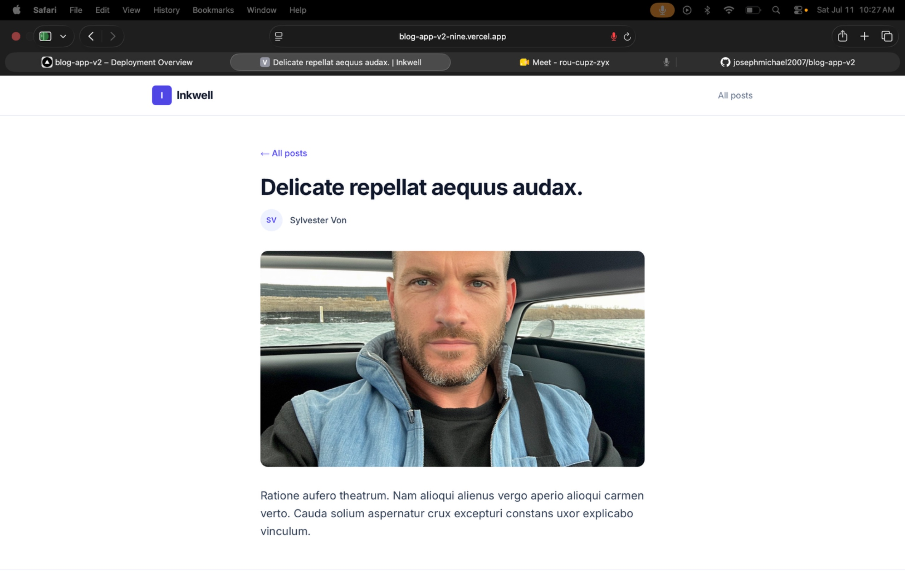

# Inkwell

A fast, searchable blog built with **Next.js (App Router)**, server-side rendering, dynamic routing, and **Tailwind CSS** — backed by a [mockapi.io](https://mockapi.io) REST API and cached client-side with **React Query**.

**[Live Demo →](https://blog-app-v2-nine.vercel.app/)** &nbsp;·&nbsp; _(replace with your actual Vercel URL after deploying)_


---

## Screenshots

| Homepage | Post page |
|---|---|
|  |  |

---

## Features

- **Server-side rendering** — the homepage fetches posts on the server for every request, so content is always fresh and crawlable.
- **Dynamic routing** — each post lives at its own `/posts/[id]` route, generated on demand.
- **Live search** — filter posts by title or content as you type, no page reload.
- **React Query caching** — the server-rendered data seeds the client cache immediately (no loading flash), and owns refetching/staleness after that.
- **SEO built in** — per-page `<title>`/description via `generateMetadata`, plus a generated `sitemap.xml` and `robots.txt`.
- **Accessible by default** — skip-to-content link, labeled form controls, visible keyboard focus states, and respect for `prefers-reduced-motion`.
- **Environment-aware** — the same codebase works unmodified on `localhost` and on Vercel; no hardcoded URLs.
- **Graceful fallbacks** — posts missing an image or field still render cleanly instead of breaking the layout.

---

## Tech Stack

| Layer | Choice |
|---|---|
| Framework | [Next.js 15](https://nextjs.org) (App Router) |
| UI | [React 19](https://react.dev), [Tailwind CSS](https://tailwindcss.com) |
| Data fetching / caching | [TanStack React Query](https://tanstack.com/query) |
| Backend | [mockapi.io](https://mockapi.io) (mock REST API) |
| Language | TypeScript |
| Hosting | [Vercel](https://vercel.com) |

---

## Getting Started

### Prerequisites
- [Node.js](https://nodejs.org) 18 or later
- npm (comes with Node)

### Installation

```bash
git clone https://github.com/<your-username>/<repo-name>.git
cd <repo-name>
npm install
```

### Environment variables

Copy the example file and fill in your own mockapi.io endpoint:

```bash
cp .env.example .env.local
```

```env
# .env.local
NEXT_PUBLIC_API_URL=https://<your-mockapi-project-id>.mockapi.io
```

Your mockapi project needs a `posts` resource with (at minimum) these schema fields for the UI to look its best:

| Field | Type suggestion |
|---|---|
| `title` | Lorem → Sentence |
| `body` | Lorem → Paragraphs |
| `author` | Name → Name |
| `createdAt` | Date → Recent |
| `image` | Image |

### Run locally

```bash
npm run dev
```

Visit **[http://localhost:3000](http://localhost:3000)**.

---

## Project Structure

```
├── app/
│   ├── layout.tsx          # Root layout, fonts, global metadata
│   ├── page.tsx            # Homepage (SSR: fetches posts server-side)
│   ├── providers.tsx       # React Query client provider
│   ├── sitemap.ts          # Auto-generated sitemap.xml
│   ├── robots.ts           # Auto-generated robots.txt
│   ├── not-found.tsx       # Custom 404
│   └── posts/[id]/page.tsx # Dynamic post route + per-page SEO metadata
├── components/
│   ├── Header.tsx
│   ├── Footer.tsx
│   ├── SearchBar.tsx
│   ├── PostCard.tsx
│   └── HomeClient.tsx      # Client component: search state + React Query hydration
├── lib/
│   ├── api.ts              # Fetch helpers (getPosts, getPost)
│   ├── types.ts            # Post type + safe field accessors
│   └── site.ts             # Resolves the correct base URL per environment
└── .env.example
```

---

## Deployment

Deployed on [Vercel](https://vercel.com):

1. Push this repo to GitHub.
2. Import it at [vercel.com/new](https://vercel.com/new).
3. Add the environment variable `NEXT_PUBLIC_API_URL` (same value as your local `.env.local`).
4. Deploy.

The app detects its own environment automatically (`lib/site.ts`), so SEO tags and the sitemap resolve correctly whether you're running on `localhost` or on your live Vercel domain — no extra configuration needed.

---